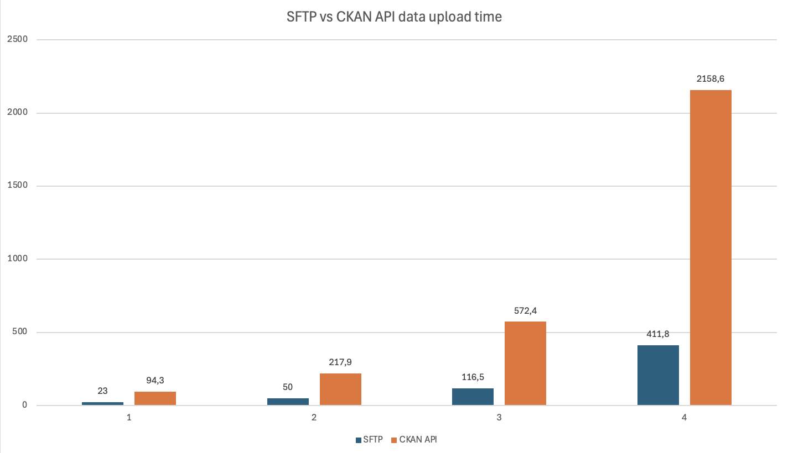
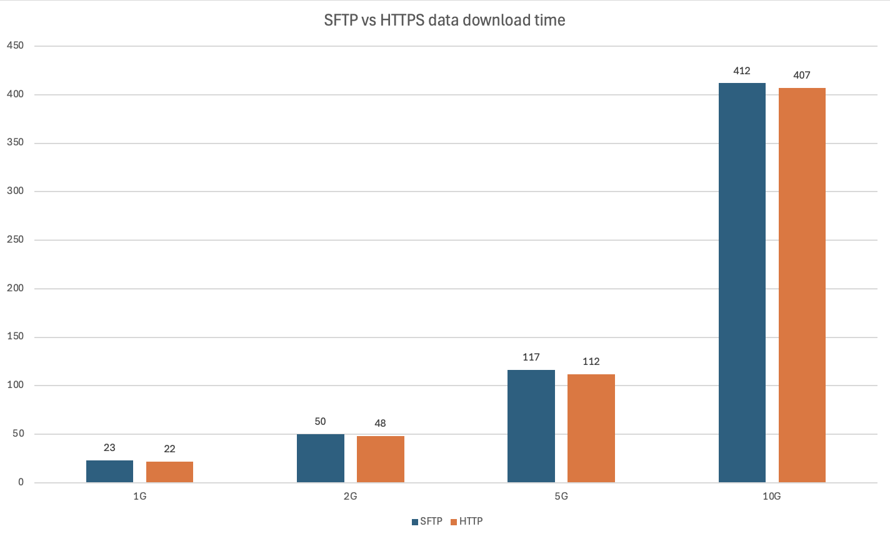

# CKAN2HPC Client

Python client for integrating **CKAN data portals** with **HPC
environments**.

The tool enables efficient transfer of datasets between CKAN and HPC
systems using **SFTP** or **CKAN API** while maintaining
reproducibility, integrity, and scalable data handling.

It is designed primarily for **large scientific datasets** that are
stored outside CKAN (e.g. HPC storage) but managed through CKAN
metadata.

------------------------------------------------------------------------

# Table of Contents

-   Overview
-   Features
-   Architecture
-   Installation
-   Configuration
-   Usage
-   Upload Workflow
-   Download Workflow
-   Command Reference
-   Examples
-   Project Structure
-   Security Notes
-   Troubleshooting
-   Authors
-   License

------------------------------------------------------------------------

# Overview

Many scientific infrastructures use **CKAN** as a metadata catalog while
storing actual datasets in external storage such as:

-   HPC clusters
-   scientific storage systems
-   large distributed filesystems

Uploading large files directly through CKAN is inefficient.

This client solves that problem by:

-   uploading files to **HPC storage via SFTP**
-   registering dataset resources in **CKAN**
-   enabling downloads via **HTTP or SFTP**

The tool acts as a **bridge between CKAN metadata and HPC storage**.

------------------------------------------------------------------------

# Features

## Data Upload

-   Upload **files or directories**
-   Automatic **directory compression (ZIP)**
-   Upload using:
    -   **SFTP (recommended for large files)**
    -   **CKAN API**
-   Automatic dataset creation
-   Automatic organization fallback
-   SHA256 checksum calculation
-   Unique remote filenames

## Data Download

-   Download entire **CKAN datasets**
-   Download individual **resources**
-   Download directly from **SFTP storage**







## Data Integrity

SHA256 checksum is used for:

-   file naming
-   collision prevention
-   reproducibility

## HPC-Friendly

-   avoids storing large binaries in CKAN
-   supports external storage systems
-   scalable for large datasets

------------------------------------------------------------------------

# Architecture

            +------------------+
            |      User        |
            +--------+---------+
                     |
                     | CLI
                     v
            +------------------+
            |  CKAN2HPC Client |
            +--------+---------+
                     |
           +---------+-----------+
           |                     |
           v                     v

    +--------------+      +--------------+
    |     CKAN     |      |  HPC Storage |
    | (metadata)   |      |   (files)    |
    +--------------+      +--------------+

## Upload Flow

    User → Upload Client → SFTP → HPC Storage
                          ↓
                       CKAN API
                          ↓
                   CKAN Resource URL

## Download Flow

    User → Download Client → CKAN API
                             ↓
                        Resource URL
                             ↓
                 HTTP Download or SFTP

------------------------------------------------------------------------

# Installation

## Requirements

-   Python **3.9+**
-   CKAN API access
-   SSH key access to SFTP server

Install dependencies:

``` bash
pip install ckanapi paramiko requests
```

------------------------------------------------------------------------

# Configuration

Create a configuration file `settings.ini`.

Example:

``` ini
[ckan]
url=https://ckan.example.com
organization=EXAMPLARY_ORGANIZATION
api_token=CKAN_API_TOKEN

[sftp]
server_address=ckan.example.com
server_web_port=8443
username=example_user
private_key=/home/user/.ssh/id_rsa
```

## Configuration fields

### CKAN

  Parameter      Description
  -------------- -----------------------------------------
  url            CKAN instance URL
  organization   organization used for dataset ownership
  api_token      CKAN API key

### SFTP

  Parameter         Description
  ----------------- -----------------------------------
  server_address    SFTP host
  server_web_port   HTTP access port for stored files
  username          SFTP username
  private_key       SSH private key path

------------------------------------------------------------------------

# Usage

The client consists of two scripts:

    ckan_upload.py
    ckan_download.py

------------------------------------------------------------------------

# Upload Workflow

Uploading follows these steps:

### 1. Input validation

The script checks:

-   file existence
-   dataset name
-   protocol

### 2. Directory handling

If the input path is a directory:

    directory → ZIP archive

### 3. SHA256 checksum

File is hashed:

    SHA256(file)

Example:

    original: data.csv

    stored as:
    b1946ac92492d2347c6235b4d2611184_data.csv

### 4. Upload via SFTP

File uploaded to:

    SFTP: ckan-pub/

### 5. Resource registration

CKAN resource created:

    https://server:port/~user/SHA256_filename

------------------------------------------------------------------------

# Download Workflow

The download client supports three modes.

## Dataset download

Downloads **all resources in a dataset**.

    CKAN → resource list → download each file

Command:

``` bash
python ckan_download.py -m dataset -r DATASET_NAME
```

## Resource download

Downloads a **single resource**.

    CKAN → resource metadata → download file

Command:

``` bash
python ckan_download.py -m resource -r RESOURCE_ID
```

## SFTP download

Downloads directly from **SFTP storage**.

    SFTP → file transfer

Command:

``` bash
python ckan_download.py -m sftp -r FILE_NAME
```

------------------------------------------------------------------------

# Command Reference

## Upload

Upload file:

``` bash
python ckan_upload.py -f data.csv -d climate
```

Upload directory:

``` bash
python ckan_upload.py -f ./data -d climate
```

Upload via CKAN API:

``` bash
python ckan_upload.py -f data.csv -d climate -p curl
```

## Download

Download dataset:

``` bash
python ckan_download.py -m dataset -r climate
```

Download resource:

``` bash
python ckan_download.py -m resource -r RESOURCE_ID
```

Download via SFTP:

``` bash
python ckan_download.py -m sftp -r FILE_NAME
```

------------------------------------------------------------------------

# Command Line Arguments

## Upload script

  Argument   Description
  ---------- ------------------------------------
  `-f`       file or directory path
  `-d`       dataset name
  `-p`       transfer protocol (`sftp`, `curl`)

## Download script

  Argument   Description
  ---------- -----------------------------------------------
  `-m`       download mode (`dataset`, `resource`, `sftp`)
  `-r`       dataset name, resource id, or filename
  `-d`       output directory

------------------------------------------------------------------------

# Project Structure

    .
    ├── ckan_upload.py
    ├── ckan_download.py
    ├── config.py
    ├── settings.ini
    ├── docs/
    │   ├── upload.png
    │   └── download.png
    └── README.md

------------------------------------------------------------------------

# Security Notes

## Use SSH keys

Never use password authentication.

    ~/.ssh/id_rsa

## Protect API tokens

Do not commit:

    settings.ini

Add to `.gitignore`:

    settings.ini

## Permissions

Restrict SSH key access:

``` bash
chmod 600 ~/.ssh/id_rsa
```

------------------------------------------------------------------------

# Troubleshooting

## Authentication error

Check:

-   CKAN API token
-   SSH private key

## SFTP upload fails

Verify:

-   SFTP host
-   username
-   SSH key permissions

## Dataset creation error

Ensure the user has permissions in the specified organization.

------------------------------------------------------------------------

# Authors

Developed by **PSNC -- Poznan Supercomputing and Networking Center**

Piotr Dzierżak\
Michał Lawenda

https://psnc.pl

------------------------------------------------------------------------

# License

MIT License
